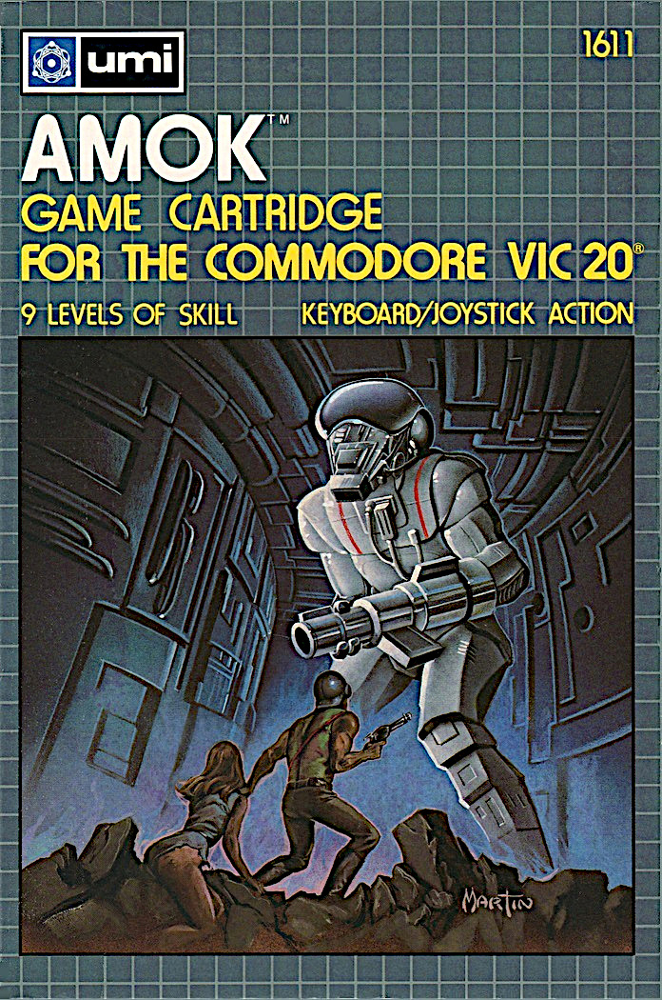

# Amok for the Commodore Vic20
Amok game disassembly with build scripts for reassembly for the unexpanded and 8K+ expanded Vic20.

The 8K+ expanded version is the same as the unexpanded version except it works in the 8K+ expanded memory configuration.

Amend `a_run.bat` by commenting / uncommenting the command to run either the unexpanded or 8K+ expanded version.




## Disassembly notes
1. Go to https://www.masswerk.at/6502/disassembler.html
2. Choose load option to load PRG file
3. Add symbols to symbol table - take common symbols from another project. Examples:
    _SCREEN_ADDR = $1e00
    _COLOUR_SCREEN_ADDR = $9600
    _BACKGROUND_BORDER_COLOUR = $900f
4. The start address is usually correct, check the first 2 bytes of the PRG to confirm (low, high byte)
5. Choose dissemble and copy paste full disassemby into Excel spreadsheet
6. Review the code, looking for:
   - basic loader at the start
   - RTS often the end of a subroutine indicating end of code (but it can be data)
   - data may follow the RTS, sometimes no label on the following line but the best indicator is 6502 assembler which doesn't look sensible, often including ? characters
7. Categorise the code into basic loader, code and data with a extra column in the spreadsheet
8. Move the results into main.asm. The basic loader and data will be bytes, the code will be assembler. For example: basic loader, code (extract) and data (extract).

```
* = $1001
!byte $0c,$10,$0a,$00,$9e,$20,$34,$31,$31,$30,$00,$00,$00
;Note                 sys       4   1   1   0            is sys4110

l100e         lda #22
              sta $9002
              lda #9
              sta $78

!byte $00,$00,$00,$00,$00,$00,$00,$00,$00
```
9. Save main.asm and compile it (see build script). Code such as `asl a` or `rol a` may need changing to just `asl` or `rol` (not a complete list).
10. Perform a byte-compare of the compiled PRG result against the original PRG (Notepadd++ does this). They should completely match.
11. The translation of the assembler is next, aimed at understanding what the code does. A good resource for system memory addresses is COMPUTE! Mapping the VIC (MTV).
12. Repeat the byte-compare of the compiled PRG result against the original PRG at various milestones.
13. Ensure big sections of data are labelled (add own labels where neded), they may indicate redefined custom characters at addresses like `$1800`,`$C000` (see MTV page 130). Check the `symbols` file generated after compilation for this.
14. It can be worth reformatting hex absolute values e.g. `#$3f` to it's decimal equivalent, `#63` in this case. All $-values in code (not data) are memory addresses.
15. Searching for `lda $----,x`, `sta $----,x`, `inc $----,y` etc often points to references to bytes in data blocks.
16. Also search for `lda $----`, `sta $----`, and the same for `x` and `y` registers
17. Search for any `$9---` system addresses not in the symbols table (see above)
18. Screen or even subroutine high-low addresses might be in data bytes.
